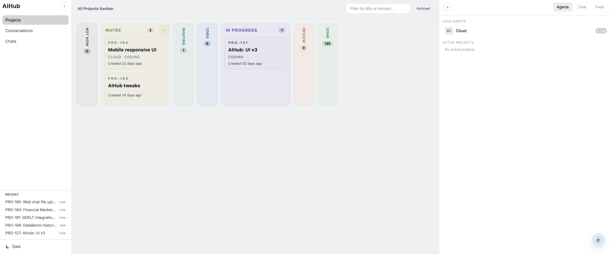

# AIHub

Multi-agent gateway for AI agents. Exposes agents via web UI, Discord, Slack, CLI, and scheduled jobs.



**Main features:**

- Multi-agent orchestration spaces
- Project management with Kanban boards
- Direct chat with CLI agents
- Board home view with full-history chat rendering, live tool-call streaming, stop button, queued follow-ups while streaming, and reactive canvas tabs
- Drag-and-drop file attach in chat history, composer, or `+`
- Virtualized long-thread project agent chat with smart near-bottom autoscroll
- Specs and task management
- Activity feed
- Local media foundation for image/document uploads and agent-created file downloads
- File-based by default; optional SQLite only for multi-user auth

## Quick Start

```bash

# Clone the repo
git clone https://github.com/tobalsan/aihub.git
cd aihub

# Install
pnpm install
```

## Configuration

The app uses a main config file at `$AIHUB_HOME/aihub.json` (default: `~/.aihub/aihub.json`).
All data is saved as markdown files in the projects folder.
By default, if you don't specify anything, all projects are saved in `~/projects`.
Config now supports a modular v2 shape with optional top-level `version`, `onecli`, and `components`. Legacy v1 configs still load and are auto-migrated in memory at startup.
Config has a single extension model. Root `extensions.<id>` holds shared extension defaults, and `agents[].extensions.<id>` opts an agent into tool-style extensions with optional per-agent overrides.
Startup now resolves `$env:` refs once and threads the resolved config through runtime/component context.
Core routes now live in `apps/gateway/src/server/api.core.ts`. Component-owned routes mount through the component lifecycle, declare their own API route prefixes, and disabled component endpoints return `404 { error: "component_disabled", component: "<id>" }` without eagerly loading disabled component modules.
The main HTTP app now delegates `/api/*` requests into the live component-mutated API router, so `pnpm dev` sees newly enabled route-owning components instead of a stale route snapshot.
OneCLI now uses the dedicated top-level `onecli` config section for native proxy/gateway wiring.

The app has two levels of agents: lead agents that you configure in the main config file, and subagents, that are started using either Claude Code, Codex, or Pi CLI coding agents. This means you have to have them installed to use subagents.

Agents can optionally run inside ephemeral Docker containers for filesystem, network, and credential isolation. See [Container Isolation](#container-isolation) below for setup.

### Lead agents

Lead agent configuration is optional, as orchestration is done via CLI subagents.
But if you want to configure lead agent, you can do so by adding them in the main config file. Each agent has their workspace, and is powered by Pi SDK under the hood.

```bash
export AIHUB_HOME="${AIHUB_HOME:-$HOME/.aihub}"
mkdir -p "$AIHUB_HOME"
cat > "$AIHUB_HOME/aihub.json" << 'EOF'
{
  "version": 2,
  "agents": [
    {
      "id": "my-agent",
      "name": "My Agent",
      "workspace": "~/workspace/my-agent",
      "model": { "provider": "anthropic", "model": "claude-sonnet-4-5-20250929" }
    },
    {
      "id": "openclaw-agent",
      "name": "Cloud",
      "workspace": "~/workspace/cloud",
      "sdk": "openclaw",
      "openclaw": {
        "gatewayUrl": "ws://127.0.0.1:18789",
        "token": "your-openclaw-gateway-token",
        "sessionKey": "agent:main:main"
      },
      "model": { "provider": "openclaw", "model": "claude-sonnet-4" }
    }
  ],
  "components": {
    "projects": {
      "enabled": true,
      "root": "/your/custom/projects/path"
    },
    "scheduler": {
      "enabled": true,
      "tickSeconds": 60
    }
  }
}
EOF
```

For repo-local dev, `pnpm init-dev-config` writes `./.aihub/aihub.json` from `scripts/config-template.json`, picking the first free UI port in `3001-3100` and the first free gateway port in `4001-4100`.

### Built-in components

AIHub v2 is modular. These are the built-in component IDs you can enable under `components`:

- `discord`: one shared Discord bot that routes configured channels/DMs to agents
- `slack`: one shared Slack Socket Mode bot that routes configured channels/DMs to agents
- `scheduler`: recurring schedule runner for interval/daily jobs
- `heartbeat`: periodic heartbeat prompts for agents; depends on `scheduler`
- `amsg`: background watcher that checks agent amsg inboxes and nudges agents when new messages arrive
- `conversations`: saved conversation API/UI surface for browsing threads, attachments, and creating projects from conversations
- `projects`: project management surface including areas, kanban, taskboard, activity feed, subagents, and Space workflows
- `multiUser`: optional Better Auth + SQLite auth layer with per-user isolation and admin APIs
- `langfuse`: optional tracing component for stream/history events, LLM generations, tool spans, and model usage
- `webhooks`: auto-loaded when any agent defines `webhooks`; exposes `/hooks/:agentId/:name/:secret`

If a component key is absent, it is disabled and not loaded.
`webhooks` is the exception: it is configured per agent and needs no top-level component key.
Inbound Slack and Discord messages now append a normalized `[CHANNEL CONTEXT]` block to the actual agent system prompt. It includes the channel (`slack` or `discord`), place (`#channel`, `#channel / thread`, or `direct message / <peer>`), conversation type, sender, and fallback-filled channel/topic/thread/history fields. The same block is persisted in full history as a system message and forwarded to Langfuse as both trace input and generation `systemPrompt` metadata. First-party gateway/web/CLI messages do not get this block.

### Webhooks

Agents can be triggered by external HTTP webhooks:

```json
{
  "agents": [
    {
      "id": "sales",
      "name": "Sales",
      "workspace": "~/agents/sales",
      "model": { "provider": "anthropic", "model": "claude-sonnet-4" },
      "webhooks": {
        "notion": {
          "prompt": "Payload: $WEBHOOK_PAYLOAD",
          "langfuseTracing": true,
          "signingSecret": "$env:NOTION_WEBHOOK_SECRET",
          "verification": {
            "location": "payload",
            "fieldName": "verification_token"
          },
          "maxPayloadSize": 1048576
        }
      }
    }
  ]
}
```

On startup, AIHub creates `$AIHUB_HOME/webhook-secrets.json` and logs the full URL:

```text
[webhooks] sales/notion -> http://127.0.0.1:4000/hooks/sales/notion/<secret>
```

`prompt` can be inline text or a `.md`/`.txt` file path relative to the agent workspace; paths outside the workspace are rejected.
Supported interpolation variables: `$WEBHOOK_ORIGIN_URL`, `$WEBHOOK_HEADERS`, `$WEBHOOK_PAYLOAD`.
Each webhook invocation uses a fresh `webhook:<agentId>:<name>:<requestId>` session.
When Langfuse is enabled, webhook traces use surface `webhook` unless `langfuseTracing: false`.
Set `verification` for setup requests that include a known header or payload field, such as Notion's `verification_token`; matching requests return `{ "ok": true, "verification": true }` without signature checks or agent invocation. Requests that do not include the configured field continue through normal webhook handling.
Known GitHub, Notion, and Zendesk webhooks verify HMAC-SHA256 signatures when `signingSecret` is set.
Payloads are capped at `maxPayloadSize` bytes per webhook, defaulting to 1MB.
Example prompt templates live in `docs/examples/webhooks/`.

Rotate a webhook URL secret with:

```bash
aihub webhooks rotate sales notion
# or: aihub webhooks rotate sales notion
```

Running gateways pick up rotated secrets without restart.

### Multi-User Mode

Enable multi-user auth with a top-level `multiUser` block in `$AIHUB_HOME/aihub.json`:

```json
{
  "version": 2,
  "agents": [
    {
      "id": "main",
      "name": "Main",
      "workspace": "~/workspace/main",
      "model": {
        "provider": "anthropic",
        "model": "claude-sonnet-4-5-20250929"
      }
    }
  ],
  "multiUser": {
    "enabled": true,
    "oauth": {
      "google": {
        "clientId": "$env:GOOGLE_CLIENT_ID",
        "clientSecret": "$env:GOOGLE_CLIENT_SECRET"
      }
    },
    "allowedDomains": ["example.com"],
    "sessionSecret": "$env:BETTER_AUTH_SECRET"
  }
}
```

Required config:

- `multiUser.enabled: true`
- `multiUser.oauth.google.clientId`
- `multiUser.oauth.google.clientSecret`
- `multiUser.sessionSecret`
- `multiUser.allowedDomains` if you want to restrict signups by email domain

Bootstrap flow:

1. Set Google OAuth credentials and `BETTER_AUTH_SECRET`, then restart the gateway.
2. Gateway creates `$AIHUB_HOME/auth.db`, runs Better Auth migrations, and mounts `/api/auth/*`.
3. The first Google OAuth user becomes `admin`.
4. That admin approves later signups and manages roles at `/admin/users`.
5. Admins manage per-user agent access at `/admin/agents`.

Notes:

- Multi-user mode adds `/login`, `/api/me`, `/api/admin/users`, and `/api/admin/agents`.
- Gateway initializes the Better Auth runtime before opening the HTTP listener, so `/api/auth/*` is live as soon as the server starts.
- Sessions/history move to per-user paths under `$AIHUB_HOME/users/<userId>/`.
- There is no migration for existing single-user session/history data. Treat enablement as a fresh start.

### Extensions

Extensions own optional gateway routes, lifecycle hooks, prompt contributions, and agent tools. Tool-style extensions are config-driven, stateless tool bundles mounted per agent.

- Root `extensions.<id>` holds shared defaults for both first-party and external extensions.
- `agents[].extensions.<id>` opts an agent into a tool-style extension and can override root defaults. Presence is enough to enable it unless `enabled: false`.
- External extensions load from `extensionsPath` when set, otherwise `$AIHUB_HOME/extensions` (default `~/.aihub/extensions`).
- Discovery follows real directories and symlinked extension directories.
- The helper for migrated tool bundles exports from `packages/shared/src/tool-extension.ts`.
- Gateway startup resolves extension secrets, validates configured mounts, warns on missing extension ids, and fails early on invalid config or missing required secrets.
- Extensions can append system-prompt guidance and expose Zod-object-backed tools to Pi agents. Pi container runs serialize extension prompt/tool metadata and execute tools through `/internal/tools`; sandbox Claude fails loudly if extension tools are configured.
- The Board extension stores user content in `$AIHUB_HOME` by default. Set `extensions.board.contentRoot` to use a custom content directory.

### OneCLI

Use top-level `onecli` for native gateway/proxy config:

```json
{
  "onecli": {
    "enabled": true,
    "gatewayUrl": "http://localhost:10255",
    "dashboardUrl": "http://localhost:10254",
    "mode": "proxy",
    "ca": { "source": "file", "path": "~/.onecli/gateway/ca.pem" }
  }
}
```

- `gatewayUrl` is required when `onecli` is configured.
- `mode` currently supports only `"proxy"`.
- `ca.source="file"` is used to propagate the same CA path to Node and Python trust env vars.
- Per-agent proxy tokens are set via `onecliToken` on each agent config (see [Agent Options](#agent-options)).
- Claude and Pi agent runs now use scoped proxy env injection when native `onecli` is enabled for that agent.
- Legacy `$secret:` lookup is removed. Use `$env:` for config values and top-level `onecli` for native gateway/proxy wiring.

### Container Isolation

Run agents inside ephemeral Docker containers for per-invocation filesystem, network, and credential isolation. Each agent invocation spawns a fresh container (`docker run -i --rm`) that reads input from stdin and writes output to stdout. The container is removed automatically when it exits.

**When to use this:**

- Multi-tenant deployments where agents must not share filesystems or credentials
- Running untrusted or third-party agent code
- Compliance requirements for credential isolation

**Prerequisites:**

- Docker must be installed and running on the gateway host
- The `aihub-agent` container image must be built (see below)
- (Optional) OneCLI proxy for credential injection and network egress control

#### 1. Build the agent image

From the repo root:

```bash
docker build -t aihub-agent:latest -f container/agent-runner/Dockerfile .
```

This builds a `node:22-slim` image with the agent-runner entry point. It does **not** contain any credentials — those are injected at runtime via the proxy or stripped from the input.

#### 2. Enable sandbox for an agent

Add a `sandbox` block to the agent config in `aihub.json`:

```json
{
  "agents": [
    {
      "id": "sandboxed-agent",
      "name": "Sandboxed Agent",
      "workspace": "~/agents/sandboxed",
      "model": {
        "provider": "anthropic",
        "model": "claude-sonnet-4-5-20250929"
      },
      "sandbox": {
        "enabled": true
      }
    }
  ]
}
```

That's the minimum. All other sandbox settings have sensible defaults.

#### 3. (Optional) Configure global sandbox defaults

Add a top-level `sandbox` block for network and mount security settings:

```json
{
  "sandbox": {
    "sharedDir": "~/agents/shared",
    "network": {
      "name": "aihub-agents",
      "internal": true
    },
    "mountAllowlist": {
      "allowedRoots": ["~/agents", "~/projects"],
      "blockedPatterns": [".ssh", ".gnupg", ".aws", ".env"]
    }
  }
}
```

OneCLI proxy config lives in the top-level `onecli` block (see [OneCLI](#onecli)) — the container adapter reads from there automatically. Set `onecliToken` on each sandboxed agent so the container authenticates with OneCLI.

#### Per-agent sandbox options

| Field               | Default                            | Description                                                            |
| ------------------- | ---------------------------------- | ---------------------------------------------------------------------- |
| `enabled`           | `false`                            | Enable container isolation for this agent                              |
| `image`             | `aihub-agent:latest`               | Docker image to use                                                    |
| `network`           | From global `sandbox.network.name` | Docker network name                                                    |
| `memory`            | `2g`                               | Memory limit                                                           |
| `cpus`              | `1`                                | CPU limit                                                              |
| `timeout`           | `300`                              | Max seconds before the container is stopped and killed                 |
| `workspaceWritable` | `false`                            | Allow the agent to write to its workspace mount                        |
| `env`               | `{}`                               | Extra environment variables (secret values are automatically filtered) |
| `mounts`            | `[]`                               | Additional bind mounts (validated against the allowlist)               |

Sandbox containers also inherit safe top-level `aihub.json.env` entries. Per-agent `sandbox.env` is applied on top.

#### How it works

When `sandbox.enabled` is `true`, the gateway replaces the normal in-process agent run with a container spawn:

1. Gateway builds Docker args and bind mounts from the agent + global config
2. Spawns `docker run -i --rm --name aihub-agent-<id>-<ts> ...`
3. Writes a `ContainerInput` JSON payload to the container's stdin
4. Agent-runner inside the container executes the agent turn (Pi SDK or Claude CLI)
5. Container writes structured output to stdout between sentinel markers
6. Gateway parses the output and routes the response to the client
7. Container is removed on exit (`--rm`)

**Follow-up messages** while a container is running are delivered via filesystem IPC — the gateway writes JSON files to a bind-mounted input directory that the agent-runner polls.

**Orchestration tools** (subagent spawn, project CRUD) call back to the gateway's `/internal/tools` endpoint from inside the container.

**Extension tools** are serialized into `ContainerInput.extensionTools` by the gateway and executed through `/internal/tools`. Extension system-prompt contributions are serialized through `ContainerInput.extensionSystemPrompts`.

#### Network and credential model

With the default `--internal` Docker network, containers have **no direct internet access**. All outbound HTTPS (LLM API calls, connector calls) is routed through the OneCLI proxy, which injects per-host credentials. **No credentials ever exist inside the container** — no env vars, no files, no mounted configs.

If you don't use OneCLI, containers can still run but will need direct network access (set `internal: false` or override the per-agent `network`).

#### Security features

- **Ephemeral containers**: fresh environment every invocation, no persistent state
- **Read-only workspace**: agent identity files (SOUL.md, skills) are mounted read-only by default
- **`.env` shadowing**: if the workspace contains a `.env` file, it is shadowed with `/dev/null` inside the container
- **Top-level config env propagation**: safe `aihub.json.env` entries are forwarded into sandbox containers
- **`sandbox.env` filtering**: secret-looking env vars (keys containing KEY/SECRET/TOKEN/etc., values starting with `sk-`/`ghp_`/etc.) are automatically stripped
- **Mount allowlist**: custom mounts are validated against `sandbox.mountAllowlist.allowedRoots` and blocked if they match `blockedPatterns`
- **Path traversal prevention**: container mount paths with `..` or non-absolute paths are rejected
- **Unprivileged execution**: containers run as non-root (`--user <uid>:<gid>`)
- **Orphan cleanup**: stale containers from crashed runs are cleaned on gateway startup and shutdown
- **Graceful shutdown**: SIGTERM/SIGINT stops all running containers before the gateway exits

#### Startup behavior

On gateway startup, if any agent has `sandbox.enabled: true`:

1. The Docker network is created (if it doesn't exist): `docker network create --internal aihub-agents`
2. Stale containers from previous runs are removed: `docker rm -f` all `aihub-agent-*` containers

On gateway shutdown (SIGTERM/SIGINT), all running sandbox containers are stopped.

## Starting the app

```bash
# Build & run
pnpm build && pnpm build:web
pnpm aihub gateway
```

Open http://localhost:3000

## Project Structure

```
apps/
  gateway/    # Server, CLI, agent runtime, opt-in components
  web/        # Solid.js chat UI
packages/
  extensions/ # First-party gateway extensions
  shared/     # Types & schemas
```

## Web UI Navigation

- Left sidebar: AIHub logo + primary links (`Chats` always; `Projects` and `Conversations` only when those components are enabled)
- Main route: `/` for Areas overview (new homepage)
- Areas homepage supports quick area creation with auto-generated ids and color picker selection
- Kanban routes: `/projects` for all projects, `/projects?area=<id>` for area-filtered kanban
- Right sidebar tabs: `Agents`, `Chat`, `Feed`
- Collapsed left/right sidebars hover-expand as overlays instead of pushing the main content
- Legacy direct-chat agent list remains at `/agents`
- `Archived` button lives in the projects header (top-right) and toggles archived-projects section
- Left sidebar nav is persistent across `/projects`, `/agents`, `/conversations`, and `/chat/:agentId`
- Project detail overlay on `/projects/:id` keeps the same single left sidebar as `/projects`
- The right context panel stays visible on `/projects/:id`, with recent projects moved to the bottom of that sidebar
- Project detail is mobile/tablet responsive: `<=768px` uses a single-column `Overview | Chat | Activity | Changes | Spec` tabbed view, and `769px-1199px` uses a `280px` left rail with merged center/right tabs
- In `SPECS.md` view, one top-right toggle collapses/expands both Tasks and Acceptance Criteria to free more room for the markdown pane
- Right context panel `Recent` list shows the 5 most recently viewed projects from browser localStorage
- Web UI fetches `/api/capabilities` on boot, hides disabled component nav, and lazy-loads projects/conversations route bundles only when enabled
- Intercom-style quick chat is available globally via a fixed bottom-right bubble; it opens a lead-agent overlay with agent picker, streaming chat, and image attachments
- Lead `ChatView` aborts preserve any assistant text already streamed before `/abort` or the Stop button, then show an `Interrupted` marker instead of dropping the partial reply
- Project-detail UI spawns use name-based session slugs, so the generated session folder follows the displayed agent name instead of a random id
- Project detail center-panel chat keeps `Send` available while a run is active and also shows `Stop` (lead: `/abort`; subagent: interrupt endpoint for codex/claude/pi); subagent follow-ups sent mid-run stay queued in the UI and flush after the active CLI run completes
- Changes tab branch header is expandable: click branch aggregate stats to view per-file pending +/- counts (when available)
- Space Commit Log rows show relative commit age (`now`, `1m`, `2h`, `3d`) beside author metadata

## CLI

```bash
pnpm aihub gateway [--port 4000] [--host 127.0.0.1] [--agent-id <id>]
pnpm aihub agent list
pnpm aihub send -a <agentId> -m "Hello" [-s <sessionId>]

# Projects CLI (aihub projects; uses gateway API)
pnpm aihub projects list [--status <status>] [--owner <owner>] [--domain <domain>]
pnpm aihub projects create --title "My Project" [description] [--specs <text>|-] [--status <status>] [--area <area>]
pnpm aihub projects get <id>
pnpm aihub projects update <id> [--title <title>] [--status <status>] [--readme <text>|-] [--specs <text>|-]
pnpm aihub projects move <id> <status>
pnpm aihub projects start <id> [--agent <cli|aihub:id>] [--subagent <name>] [--name <run-name>] [--model <id>] [--reasoning-effort <level>] [--thinking <level>] [--mode <main-run|clone|worktree|none>] [--branch <branch>] [--slug <slug>] [--prompt-role <coordinator|worker|reviewer|legacy>] [--allow-overrides] [--include-default-prompt|--exclude-default-prompt] [--include-role-instructions|--exclude-role-instructions] [--include-post-run|--exclude-post-run] [--custom-prompt <text>|-]
pnpm aihub projects rename <id> --slug <slug> [--name <name>] [--model <id>] [--reasoning-effort <level>] [--thinking <level>]
pnpm aihub projects status <id> [--slug <slug>] [--list] [--limit <n>] [--json]

# Local config CLI
pnpm aihub projects config migrate [--config <path>] [--dry-run]
pnpm aihub projects config validate [--config <path>]

# Note: v1 -> v2 migration only adds component entries when legacy config explicitly implied them.
# It no longer auto-adds `components.amsg` or `components.conversations` just because agents exist.

# `--subagent <name>` resolves a config-defined subagent from `aihub.json`.
# The server applies that subagent's locked defaults for harness/model/reasoning/runMode/type.
# Override locked fields only with `--allow-overrides`.
# Lead agents launch with `--agent aihub:<id>` and use project-scoped sessions.

# Override API URL (highest precedence)
AIHUB_API_URL=http://127.0.0.1:4000 pnpm aihub projects list
# Backward-compatible alias
AIHUB_URL=http://127.0.0.1:4000 pnpm aihub projects list
# Config file fallback ($AIHUB_HOME/aihub.json, default ~/.aihub/aihub.json): { "apiUrl": "http://127.0.0.1:4000" }
# Local config commands honor: --config > $AIHUB_HOME/aihub.json
# Legacy fallback: AIHUB_CONFIG still works, but only to derive AIHUB_HOME with a deprecation warning.
# Dev launchers (`pnpm dev`, `pnpm dev:web`, gateway config loading) honor AIHUB_HOME too.

# Install the `aihub` command globally via pnpm link
pnpm --filter @aihub/gateway build
cd apps/gateway
pnpm link --global

# OAuth authentication (Pi SDK agents)
pnpm aihub auth login           # Interactive provider selection
pnpm aihub auth login anthropic # Login to specific provider
pnpm aihub auth status          # Show authenticated providers
pnpm aihub auth logout <provider>
```

Projects execution modes:

- `subagent`: default coding-agent run mode in monitoring panel.
- `ralph_loop`: iterative Ralph loop monitoring mode.
- unset: no execution mode selected.

Project Space model:

- `main-run` executes in project Space (`space/<projectId>` branch, `.../.workspaces/<projectId>/_space` worktree).
- `worktree` and `clone` remain isolated worker sandboxes.
- Worker commits are queued as `pending`; they are cherry-picked only on explicit `POST /api/projects/:id/space/integrate` (UI: Integrate Now).
- Per-entry queue controls are available via:
  - `POST /api/projects/:id/space/entries/skip`
  - `POST /api/projects/:id/space/entries/integrate`
- Changes tab also supports "Rebase on main" (`POST /api/projects/:id/space/rebase`) and space-level conflict fixing (`POST /api/projects/:id/space/rebase/fix`), surfaced through `ProjectSpaceState.rebaseConflict`.
- Conflicts block queue until resolved by the original worker.
- `POST /api/projects/:id/space/conflicts/:entryId/fix` resumes the original conflicting worker with rebase instructions (no new worker/worktree).
- Worker deliveries can include `replaces` metadata (entry IDs or worker slugs) so matching pending entries auto-transition to `skipped`.
- `POST /api/projects/:id/space/merge` merges `space/<projectId>` into base branch, pushes base when a remote exists, optionally cleans worker+Space worktrees/branches, clears queue, and marks project `status: done`.
- On re-delivery after a conflict, gateway updates the original conflict entry in-place and clears `integrationBlocked`.
- Queue statuses: `pending`, `integrated`, `conflict`, `skipped`, `stale_worker`.
- Stale handling: clone deliveries can be marked `stale_worker`; worktree runs can auto-rebase with `AIHUB_SPACE_AUTO_REBASE=true`.
- Optional write lease (`AIHUB_SPACE_WRITE_LEASE=true`) enforces exclusive `main-run` writer access via project `space-lease.json`.

Project subagent CLIs:

- Supported: `claude`, `codex`, `pi`
- List configured runtime profiles with `aihub subagents profiles` or `aihub subagents profiles --json`.
- Removed: `droid`, `gemini` (API returns validation error)
- Lead agents continue to run through the embedded Pi SDK; project subagents run as external CLIs.

## SPECS Task/Acceptance Format

Project detail parses `SPECS.md` with a specific markdown shape for `## Tasks` and `## Acceptance Criteria`.
Both sections now support optional `###` subgroup headings for organization.
The coordinator prompt also reminds agents to use this parse-safe format when updating `SPECS.md`.
Coordinator prompts now include:

- Canonical main repository path (not worker clone/worktree paths).
- Project Space worktree path (`.workspaces/<projectId>/_space`) for integration context.
- Available config-defined subagent types from `aihub.json`.
- `aihub projects` delegation preflight (`command -v aihub && aihub projects --version`) before `aihub projects start --subagent ...`.
- `aihub projects start --subagent <name>` delegation examples that avoid locked flags unless `--allow-overrides` is set, plus a reminder to choose an exact configured subagent name from `## Available Subagent Types` (or inspect AIHub config first if none are listed).
- Post-run comment instructions use `--author <your name>`; the deprecated Cloud/openclaw follow-up step was removed.
  Shell tool cards show a warning callout (`No output captured`) when exec/bash output is structurally empty.
  Worker/reviewer prompts remain scoped to their run workspace (`clone`/`worktree`/`main-run`/`none`).
  Worker prompts explicitly require committing implementation once checks pass.

Repo resolution for subagent/ralph runner modes (`clone`/`worktree`/`main-run`) now falls back to the project area's `repo` when project `frontmatter.repo` is unset.

Use the canonical guide:

- `docs/specs-task-format.md`

## OAuth Authentication

Pi SDK agents can use OAuth tokens instead of API keys. Supported providers: `anthropic`, `openai-codex`, `github-copilot`, `google-gemini-cli`, `google-antigravity`.

```bash
# Login once
pnpm aihub auth login anthropic

# Configure agent to use OAuth
```

```json
{
  "agents": [
    {
      "id": "my-agent",
      "workspace": "~/workspace",
      "auth": { "mode": "oauth" },
      "model": { "provider": "anthropic", "model": "claude-opus-4-5" }
    }
  ]
}
```

**API Key auth (e.g. OpenRouter):**

```json
{
  "env": { "OPENROUTER_API_KEY": "sk-or-..." },
  "agents": [
    {
      "id": "my-agent",
      "workspace": "~/workspace",
      "auth": { "mode": "api_key" },
      "model": {
        "provider": "openrouter",
        "model": "anthropic/claude-sonnet-4"
      }
    }
  ]
}
```

Credentials stored in `$AIHUB_HOME/auth.json` (default: `~/.aihub/auth.json`). Tokens auto-refresh when expired.

## OpenClaw SDK

Connect to an [OpenClaw](https://github.com/openclaw/openclaw) gateway to use an OpenClaw agent from AIHub. This allows you to interact with OpenClaw agents through the AIHub web UI.

If you use the `sessionKey: agent:main:main`, then it while share the same conversation context. The first two elements must match the configured agents in OpenClaw, e.g. if you configured a `main` agent, the session key must start with `agent:main:`, otherwise it will create a new agent profile in `~/.openclaw`. The third key is how control the behavior. Using `main` will continue in the OpenClaw main session, while anything else will create a new session id `third_key-openclaw`.

```json
{
  "agents": [
    {
      "id": "cloud",
      "name": "Cloud",
      "workspace": "~/workspace/cloud",
      "sdk": "openclaw",
      "openclaw": {
        "gatewayUrl": "ws://127.0.0.1:18789",
        "token": "your-openclaw-gateway-token",
        "sessionKey": "agent:main:main"
      },
      "model": { "provider": "openclaw", "model": "claude-sonnet-4" }
    }
  ]
}
```

| Field                 | Description                                                             |
| --------------------- | ----------------------------------------------------------------------- |
| `openclaw.gatewayUrl` | WebSocket URL of the OpenClaw gateway (default: `ws://127.0.0.1:18789`) |
| `openclaw.token`      | Gateway authentication token (from your OpenClaw config)                |
| `openclaw.sessionKey` | Target session key to connect to                                        |

**Finding the session key:**

Run `openclaw sessions list` on the OpenClaw side to see available sessions:

```bash
openclaw sessions list
# Output shows session keys like: agent:main:main, agent:main:whatsapp:..., etc.
```

**Notes:**

- The `workspace` and `model` fields are still required for schema validation
- The `model` field doesn't control the actual model (that's configured in OpenClaw) - it's just for display/validation
- Set `OPENCLAW_DEBUG=1` environment variable to log WebSocket frames for debugging

## API

| Endpoint                                         | Method          | Description                                           |
| ------------------------------------------------ | --------------- | ----------------------------------------------------- |
| `/api/agents`                                    | GET             | List agents                                           |
| `/api/agents/:id/messages`                       | POST            | Send message                                          |
| `/api/agents/:id/history`                        | GET             | Session history (?sessionKey=main&view=simple\|full)  |
| `/api/schedules`                                 | GET/POST        | List/create schedules                                 |
| `/api/schedules/:id`                             | PATCH/DELETE    | Update/delete schedule                                |
| `/api/projects`                                  | GET/POST        | List/create projects                                  |
| `/api/projects/:id`                              | GET/PATCH       | Get/update project                                    |
| `/api/projects/:id/space`                        | GET             | Get project Space state                               |
| `/api/projects/:id/space/integrate`              | POST            | Resume/pick pending Space queue                       |
| `/api/projects/:id/space/entries/skip`           | POST            | Mark selected pending Space entries as skipped        |
| `/api/projects/:id/space/entries/integrate`      | POST            | Integrate selected pending Space entries              |
| `/api/projects/:id/space/merge`                  | POST            | Merge Space into base branch (`cleanup` default true) |
| `/api/projects/:id/space/commits`                | GET             | Get Space commit log                                  |
| `/api/projects/:id/space/contributions/:entryId` | GET             | Get per-entry contribution details                    |
| `/api/projects/:id/space/conflicts/:entryId/fix` | POST            | Resume original conflicted worker                     |
| `/api/projects/:id/space/lease`                  | GET/POST/DELETE | Read/acquire/release Space write lease (flagged)      |
| `/api/projects/:id/changes`                      | GET             | Get project changes (Space-first source)              |
| `/api/projects/:id/commit`                       | POST            | Commit project changes in resolved source             |
| `/api/projects/:id/pr-target`                    | GET             | Get compare URL for PR creation from current branch   |
| `/ws`                                            | WS              | WebSocket streaming (send + subscribe)                |

Project API details: `docs/projects_api.md`

## Configuration

`$AIHUB_HOME/aihub.json` (default: `~/.aihub/aihub.json`):

```json
{
  "agents": [
    {
      "id": "agent-1",
      "name": "Agent One",
      "workspace": "~/projects/agent-1",
      "model": {
        "provider": "anthropic",
        "model": "claude-sonnet-4-5-20250929"
      },
      "thinkLevel": "off",
      "queueMode": "queue",
      "amsg": { "id": "agent-1", "enabled": true }
    }
  ],
  "sessions": { "idleMinutes": 360 },
  "gateway": { "port": 4000, "bind": "tailnet" },
  "scheduler": { "enabled": true, "tickSeconds": 60 },
  "ui": { "port": 3000, "bind": "loopback" },
  "projects": { "root": "~/projects" },
  "env": { "OPENROUTER_API_KEY": "sk-or-..." }
}
```

### Agent Options

| Field              | Description                                                                          |
| ------------------ | ------------------------------------------------------------------------------------ |
| `id`               | Unique identifier                                                                    |
| `name`             | Display name                                                                         |
| `workspace`        | Agent working directory                                                              |
| `sdk`              | Agent SDK: `pi` (default), `claude`, or `openclaw`                                   |
| `model.provider`   | Model provider (required for Pi SDK)                                                 |
| `model.model`      | Model name                                                                           |
| `model.base_url`   | API proxy URL (Claude SDK only)                                                      |
| `model.auth_token` | API auth token (Claude SDK only, overrides env)                                      |
| `auth.mode`        | `oauth`, `api_key`, or `proxy` (Pi SDK only)                                         |
| `thinkLevel`       | off, minimal, low, medium, high                                                      |
| `queueMode`        | `queue` (inject into current run) or `interrupt` (abort & restart)                   |
| `discord`          | Discord bot config (legacy per-agent; prefer [Channels](#channels) component config) |
| `slack`            | Slack bot config (per-agent token; see [Channels](#channels) section)                |
| `heartbeat`        | Periodic check-in config (see below)                                                 |
| `amsg`             | Amsg inbox watcher config (`enabled` to toggle; ID read from workspace `.amsg-info`) |
| `sandbox`          | Container isolation config (see [Container Isolation](#container-isolation))         |
| `onecliToken`      | Per-agent OneCLI proxy access token (e.g. `"$env:ONECLI_MY_AGENT_TOKEN"`)            |

### Gateway Options

| Field          | Description                                                                    |
| -------------- | ------------------------------------------------------------------------------ |
| `gateway.port` | Gateway port (default: 4000)                                                   |
| `gateway.bind` | `loopback` (127.0.0.1), `lan` (0.0.0.0), or `tailnet` (auto-detect tailnet IP) |
| `gateway.host` | Explicit host (overrides `bind`)                                               |

### UI Options

| Field                      | Description                                                                    |
| -------------------------- | ------------------------------------------------------------------------------ |
| `ui.enabled`               | Auto-start web UI with gateway (default: true)                                 |
| `ui.port`                  | Web UI port (default: 3000)                                                    |
| `ui.bind`                  | `loopback` (127.0.0.1), `lan` (0.0.0.0), or `tailnet` (auto-detect tailnet IP) |
| `ui.tailscale.mode`        | `off` (default) or `serve` (enable HTTPS via `tailscale serve`)                |
| `ui.tailscale.resetOnExit` | Reset tailscale serve on exit (default: true)                                  |

**Tailscale serve (`ui.tailscale.mode: "serve"`):**

- Requires Tailscale installed and logged in
- Both `gateway.bind` and `ui.bind` must be `loopback` (or omitted)
- UI is served at `https://<tailnet>/aihub/` (base path `/aihub`)
- Serve must map `/aihub` -> `http://127.0.0.1:3000/aihub` and `/api`,`/ws` -> gateway (default `http://127.0.0.1:4000`)
- MagicDNS hostname (e.g. `https://machine.tail1234.ts.net`) only works from other devices
- Local access requires `http://127.0.0.1:<port>` (gateway: 4000, ui: 3000 by default)

### Environment Variables

Set env vars in config (applied at load time, only if not already set):

```json
{
  "env": {
    "OPENROUTER_API_KEY": "sk-or-...",
    "GROQ_API_KEY": "gsk-..."
  }
}
```

Shell env vars take precedence over config values.

## Scheduling

Create via API:

```bash
# Every 5 minutes
curl -X POST localhost:4000/api/schedules -H "Content-Type: application/json" -d '{
  "name": "Hourly check",
  "agentId": "my-agent",
  "schedule": { "type": "interval", "everyMinutes": 60 },
  "payload": { "message": "Run hourly check" }
}'

# Daily at 9am
curl -X POST localhost:4000/api/schedules -H "Content-Type: application/json" -d '{
  "name": "Daily standup",
  "agentId": "my-agent",
  "schedule": { "type": "daily", "time": "09:00", "timezone": "America/New_York" },
  "payload": { "message": "Generate standup summary" }
}'
```

## Channels

AIHub supports Discord and Slack as messaging channels. Both are opt-in via `components` in `aihub.json`.

### Discord

Connect your agent to Discord with support for guilds, DMs, reactions, and slash commands.

**Prerequisites:** Create a Discord application at https://discord.com/developers/applications, create a bot, enable **Message Content Intent**, copy the **Bot Token** and **Application ID**, then invite the bot with Send Messages, Read Message History, and Add Reactions permissions.

Inbound Discord messages inject normalized channel context into the real agent system prompt. Thread replies, for example, render `place: #projects / launch-plan`, `conversation_type: thread_reply`, and `sender: <best display name or id fallback>`.

**Basic setup** (bot responds when mentioned):

```json
{
  "components": {
    "discord": {
      "enabled": true,
      "token": "$env:DISCORD_BOT_TOKEN",
      "channels": {
        "CHANNEL_1": { "agent": "main", "requireMention": true }
      },
      "dm": { "enabled": true, "agent": "main" }
    }
  }
}
```

See [docs/discord.md](docs/discord.md) for the full config reference including guild policies, reaction notifications, broadcast mode, per-channel settings, and slash commands.

### Slack

Connect your agent to Slack via Bolt.js + Socket Mode (no public URL required). Supports channel messages, DMs, thread replies, reactions, and slash commands.

**Prerequisites:**

1. Create a Slack app at https://api.slack.com/apps
2. Enable **Socket Mode** and generate an **App-Level Token** (`xapp-`) with `connections:write` scope
3. Install the app to your workspace and copy the **Bot Token** (`xoxb-`)
4. Add bot scopes: `app_mentions:read`, `channels:history`, `channels:read`, `chat:write`, `commands`, `im:history`, `im:read`, `im:write`, `reactions:read`, `reactions:write`, `users:read`
5. Enable **Socket Mode** in the app settings

Inbound Slack messages inject the same normalized channel-context block into the real agent system prompt, using Slack display names when available and id fallbacks otherwise.

**Basic setup** (single-agent, all channels):

```json
{
  "components": {
    "slack": {
      "enabled": true,
      "token": "$env:SLACK_BOT_TOKEN",
      "appToken": "$env:SLACK_APP_TOKEN",
      "channels": {
        "C01ABCDEF": { "agent": "main" }
      },
      "dm": { "enabled": true, "agent": "main" }
    }
  }
}
```

**Multi-channel routing** with per-channel thread policy and user allowlists:

```json
{
  "components": {
    "slack": {
      "enabled": true,
      "token": "$env:SLACK_BOT_TOKEN",
      "appToken": "$env:SLACK_APP_TOKEN",
      "channels": {
        "C01ABCDEF": {
          "agent": "main",
          "requireMention": false,
          "threadPolicy": "always"
        },
        "C02GHIJKL": {
          "agent": "assistant",
          "threadPolicy": "follow",
          "users": ["U01ADMIN", "U02DEV"]
        }
      },
      "dm": {
        "enabled": true,
        "agent": "main",
        "allowFrom": ["U01ADMIN"]
      },
      "broadcastToChannel": "C03BROADCAST"
    }
  }
}
```

#### Slack Config Reference

| Field                          | Description                                                   |
| ------------------------------ | ------------------------------------------------------------- |
| `token`                        | Bot token (`xoxb-`), use `$env:SLACK_BOT_TOKEN`               |
| `appToken`                     | App-level token (`xapp-`), use `$env:SLACK_APP_TOKEN`         |
| `channels`                     | Map of channel IDs to routing config                          |
| `channels.<id>.agent`          | Agent ID to route to                                          |
| `channels.<id>.requireMention` | Require @mention to trigger (default: `true`)                 |
| `channels.<id>.threadPolicy`   | `always` (default), `never`, or `follow`                      |
| `channels.<id>.users`          | Allowed Slack user IDs (empty = all allowed)                  |
| `dm.enabled`                   | Enable DM support                                             |
| `dm.agent`                     | Agent ID for DMs                                              |
| `dm.allowFrom`                 | Allowed Slack user IDs for DMs (empty = all allowed)          |
| `broadcastToChannel`           | Post non-Slack agent responses to this channel                |
| `historyLimit`                 | Recent messages included as context (default: 20)             |
| `clearHistoryAfterReply`       | Clear history buffer after reply (default: `false`)           |
| `mentionPatterns`              | Additional regex patterns that trigger a response             |
| `showThinking`                 | Show live thinking text in a thread reply (default: `false`)  |
| `deleteThinkingOnComplete`     | Delete thinking text when the run completes (default: `true`) |

#### Thread Policy

| Value    | Behavior                                                           |
| -------- | ------------------------------------------------------------------ |
| `always` | Always reply in a thread (default, keeps channels clean)           |
| `never`  | Always reply directly in channel                                   |
| `follow` | Thread if user message was in a thread, otherwise reply in channel |

#### Slash Commands

| Command           | Description                                      |
| ----------------- | ------------------------------------------------ |
| `/new [session]`  | Start new conversation                           |
| `/stop [session]` | Stop current agent run                           |
| `/help`           | Show routing policy and config (ephemeral)       |
| `/ping`           | Health check: agent name, SDK, model (ephemeral) |

Slash commands enforce the same `users` and `allowFrom` allowlists as message routing.
Slack uses `/stop` instead of `/abort`; both route to the same internal abort behavior.

#### Slack App Manifest Commands

Add these slash commands to the Slack app manifest so they appear in Slack autocomplete. Replace request URLs with any valid HTTPS URL; Socket Mode delivers commands to Bolt without requiring a public AIHub URL.

```yaml
features:
  slash_commands:
    - command: /new
      description: Start a new AIHub conversation
      usage_hint: "[session]"
      should_escape: false
      url: https://example.com/slack/commands
    - command: /stop
      description: Stop the current AIHub run
      usage_hint: "[session]"
      should_escape: false
      url: https://example.com/slack/commands
    - command: /help
      description: Show AIHub Slack help
      should_escape: false
      url: https://example.com/slack/commands
    - command: /ping
      description: Check AIHub bot health
      should_escape: false
      url: https://example.com/slack/commands
oauth_config:
  scopes:
    bot:
      - app_mentions:read
      - channels:history
      - channels:read
      - chat:write
      - commands
      - im:history
      - im:read
      - im:write
      - reactions:read
      - reactions:write
      - users:read
settings:
  socket_mode_enabled: true
```

#### Behavior Notes

- **Typing indicator**: Adds/removes `:thinking:` reaction on user message during processing
- **Thinking display**: When `showThinking` is true, posts live-updated `_🧠 Thinking: ..._` text in the message thread
- **Message chunking**: Responses split at 4000 chars, preserving mrkdwn code blocks
- **Single-agent mode**: Omit `channels` config to route all messages to the first configured agent
- **Broadcast**: Subscribe to agent events from other sources (web, CLI, etc.) and post to `broadcastToChannel`
- **Reactions**: User reactions on messages trigger agent runs with reaction context

#### Per-Agent Tokens

Each agent can have its own Slack bot (own `token`/`appToken` pair) in the same workspace. This lets different agents appear as different bots with different names and avatars:

```json
{
  "agents": [
    {
      "id": "main",
      "name": "Main Agent",
      "workspace": "~/agents/main",
      "model": { "provider": "anthropic", "model": "claude-sonnet-4" },
      "slack": {
        "token": "$env:SLACK_MAIN_BOT_TOKEN",
        "appToken": "$env:SLACK_MAIN_APP_TOKEN"
      }
    },
    {
      "id": "assistant",
      "name": "Helper",
      "workspace": "~/agents/helper",
      "model": { "provider": "anthropic", "model": "claude-sonnet-4" },
      "slack": {
        "token": "$env:SLACK_HELPER_BOT_TOKEN",
        "appToken": "$env:SLACK_HELPER_APP_TOKEN"
      }
    }
  ]
}
```

Each agent creates its own Slack app at https://api.slack.com/apps with its own bot token and Socket Mode connection. Per-agent `slack` config supports the same fields as the component config (`channels`, `dm`, `historyLimit`, etc.).

**Note:** Per-agent mode and component shared-token mode can coexist — agents with `agent.slack` get their own bots, while `components.slack` creates an additional shared bot for channel-based routing.

## Heartbeat

Periodic agent check-ins with channel delivery for alerts.

```json
{
  "agents": [
    {
      "id": "my-agent",
      "heartbeat": {
        "every": "30m",
        "prompt": "Check on your human",
        "ackMaxChars": 300
      }
    }
  ]
}
```

| Field         | Description                                                            |
| ------------- | ---------------------------------------------------------------------- |
| `every`       | Interval (`30m`, `1h`, `0` to disable). Default: `30m`                 |
| `prompt`      | Custom prompt. Falls back to `HEARTBEAT.md` in workspace, then default |
| `ackMaxChars` | Max chars after token strip to still be "ok". Default: 300             |

**How it works:**

1. Agent is prompted at the interval
2. Agent replies with `HEARTBEAT_OK` token if all is well
3. If no token (or substantial content beyond `ackMaxChars`), the reply is delivered to the configured channel as an alert
4. Heartbeat runs don't affect session `updatedAt` (preserves idle timeout)

## Custom Models

Add custom providers via `$AIHUB_HOME/models.json` (default: `~/.aihub/models.json`):

```json
{
  "providers": {
    "my-provider": {
      "baseUrl": "https://api.example.com/v1",
      "apiKey": "PROVIDER_API_KEY", // supports direct env var resolution,
      "models": [{ "id": "my-model", "displayName": "My Model" }]
    }
  }
}
```

Synced to Pi SDK's agent dir on each run.

## Skills

Each agent can have their own skills. Skills (and other custom agent resources like commands) should be available to any coding harnesses, therefore, we use a generalized folder name. Therefore, place agent skills in `{agent_workspace}/agent/skills/`

To have them auto-loaded at runtime, they must be placed in the folder expected by the agent harness (currently only Pi). Currently, the process is manual, so for each agent, you need to create a symlink to the `./agent` folder, e.g.:

```bash
# Inside the agent workspace folder
ln -s agent .pi
```

## Development

```bash
pnpm dev          # dev mode: auto-finds ports, disables Discord/scheduler/heartbeat
pnpm dev:gateway  # gateway only with hot reload (no --dev flag, all services enabled)
pnpm dev:web      # web UI only
```

### Remote Web Dev (Projects on Another Machine)

If your web UI runs on machine A but projects live on machine B:

1. On machine B, run gateway and expose it on a reachable interface:

```json
{
  "gateway": {
    "bind": "lan",
    "port": 4000
  }
}
```

2. On machine A, configure the proxy target:

```json
{
  "gateway": {
    "host": "<machine-b-host-or-ip>",
    "port": 4000
  }
}
```

3. On machine A, run `pnpm dev:web` only.

In web dev mode, Vite proxies `/api` and `/ws` to `gateway.host:gateway.port`, so Kanban loads projects from machine B.

Do not run `pnpm dev`, `pnpm dev:gateway`, or `pnpm aihub gateway` on machine A with a remote `gateway.host`; those commands start a local gateway process that will try to bind that host and can fail with `EADDRNOTAVAIL`.

### `apiUrl` vs `gateway.host`/`gateway.port`

| Setting                         | Used by                                         | Purpose                                                                                                             |
| ------------------------------- | ----------------------------------------------- | ------------------------------------------------------------------------------------------------------------------- |
| `apiUrl` (or `AIHUB_API_URL`)   | `aihub projects` CLI                            | Direct base URL for CLI HTTP requests                                                                               |
| `gateway.host` + `gateway.port` | Gateway server config; reused by `pnpm dev:web` | Gateway listen host/port for gateway process. In `pnpm dev:web`, these same values are reused as Vite proxy target. |

In short: `apiUrl` controls CLI target. Web app uses relative `/api`/`/ws`; in `pnpm dev:web`, proxy target currently comes from `gateway.host`/`gateway.port`.

### Dev Mode

`pnpm dev` runs with the `--dev` flag, which:

- **Auto-finds free ports** if 4000/3000 are in use (scans up to +50)
- **Disables external services**: Discord, scheduler, amsg watcher, heartbeats
- **Skips Tailscale serve** setup
- **Visual indicators**: console banner, `[DEV :port]` browser title, orange sidebar badge

Run multiple dev instances simultaneously - each gets unique ports.

For production-like testing with all services:

```bash
pnpm aihub gateway  # no --dev flag
```

## Data

- Config: `$AIHUB_HOME/aihub.json` (default: `~/.aihub/aihub.json`)
- Auth: `$AIHUB_HOME/auth.json` (OAuth/API key credentials)
- Models: `$AIHUB_HOME/models.json` (optional)
- Schedules: `$AIHUB_HOME/schedules.json`
- Sessions: `$AIHUB_HOME/sessions/*.jsonl`
